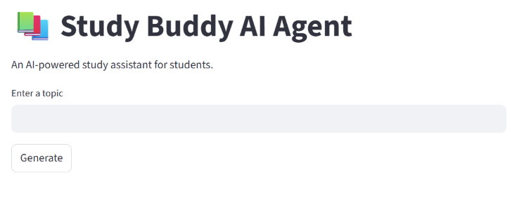

Study Buddy AI Agent

Problem

Students often struggle to plan their studies, test their understanding, and stay motivated.

Solution

Study Buddy AI Agent is a multi-agent system that helps students by generating study plans, quizzes, and motivational messages.

Agents

Planner Agent

Creates a simple study plan for the selected topic.

Quiz Agent

Generates quiz questions related to the topic.

Motivation Agent

Provides motivational messages to encourage learning.

Technologies Used

- Python
- Streamlit

Concepts Demonstrated

- Multi-Agent System
- Agent Skills
- User Interaction through Streamlit

Future Improvements

- Gemini AI integration
- Personalized study schedules
- Performance tracking
- More advanced quizzes
- screenshots:
- 
- 
- 
- 
